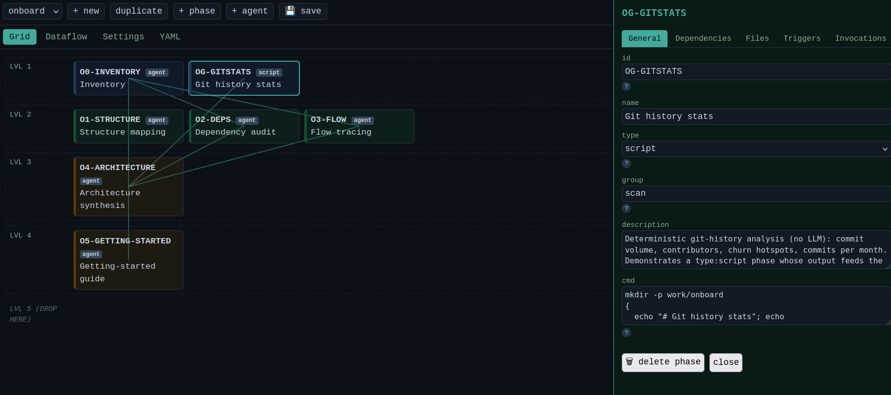
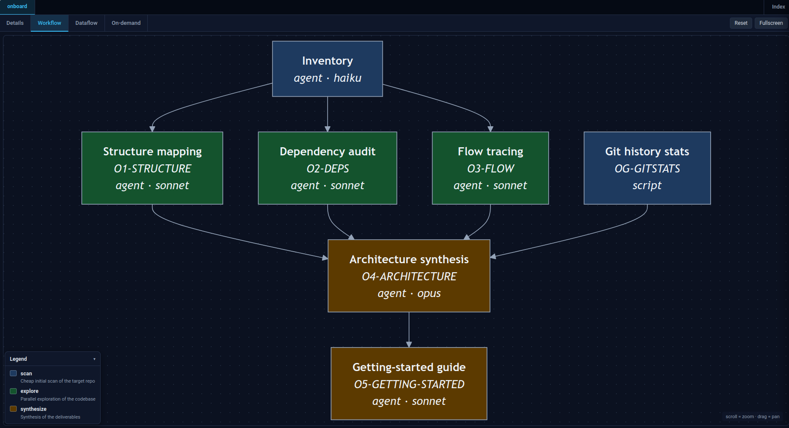
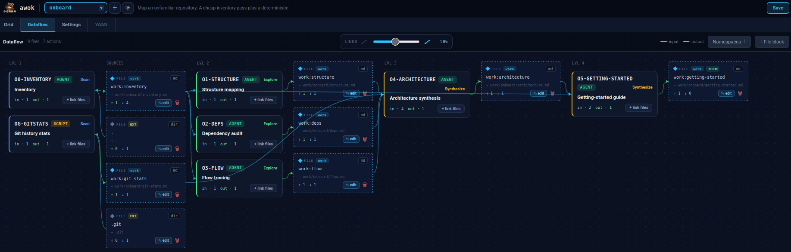

<p align="center">
  
</p>

<h1 align="center">awok — Agentic Workflow Orchestration Kompiler</h1>

Multi-agent workflows rot fast. You wire up a pipeline of sub-agents by hand —
one prompt here, a near-identical one there, the I/O contract living only in your
head — and within a week the prompts have drifted apart, nobody can see the whole
DAG anymore, and changing one phase means hunting through half a dozen files
hoping you caught them all.

**awok fixes that by making the workflow a single source of truth.** You describe
a pipeline once in YAML — its phases, the agents each one calls, what flows in and
out — and awok *compiles* it into the artifacts that drive it:

- a Claude Code `SKILL.md` the orchestrator invokes as `/<name>`,
- an offline HTML + ASCII **cartography** of the whole DAG (Mermaid, dataflow,
  on-demand agents), and
- an index of every workflow you've defined.

It can also encode **opportunistic autonomy zones** — phases where the
orchestrator is licensed to author and launch ad-hoc sub-agents to handle the
unexpected (e.g. pentest recon), kept visible and bounded in the cartography.

Crucially, awok **compiles — it does not execute.** The generated skill is run by
Claude Code (a main agent plus Task sub-agents) with a human in the loop. That
compile-only stance is what separates awok from execution engines like CrewAI,
Dagster, Dify or GitHub Actions: one YAML to edit, `awok check` to catch drift
before it ships, and a diagram you can actually read.

## Layout

| Path | Role |
|---|---|
| `src/scripts/bb-workflow` | the compiler + local web editor (`awok edit`) |
| `src/workflows/*.yaml` | **source of truth** — one file per workflow |
| `src/workflow/` | Jinja templates, JSON schema, web-editor front-end, manual sections |
| `src/agents/*.md` | agent definitions (system prompts) |
| `src/skills/<name>/SKILL.md` | **generated** — never edit by hand |
| `docs/architecture-cartography/` | **generated** HTML/ASCII cartography |
| `docs/dev/bb-workflow.md` | user guide |
| `CLAUDE.md` | development guide (was `CLAUDE-DEV.md`) |

The bundled `onboard` workflow (`src/workflows/onboard.yaml`) is the worked
example used throughout this README: it maps an unfamiliar repository — a cheap
inventory pass plus a deterministic git-history script fan out into three
parallel explorers (structure / deps / flow), which an `opus` synthesis reduces
into an architecture doc and a getting-started guide.

## Install (from scratch)

```bash
git clone <repo> awok && cd awok
./install.sh
# → creates .venv, installs deps, links `awok` into ~/.local/bin
awok validate
```

Requires Python 3 (deps: PyYAML, Jinja2, jsonschema — installed into a dedicated
`.venv` by `install.sh`, nothing touches system Python). Override interpreter or
bin dir: `PYTHON=python3.12 AWOK_BIN=~/bin ./install.sh`.

## How to use it

awok turns one YAML file into a runnable Claude Code skill. The loop is always
the same — **edit → validate → generate → install → invoke**:

```bash
# 1. Describe (or tweak) a workflow in src/workflows/<name>.yaml:
#    its phases, the agent each one calls, and the I/O that flows between them.
awok validate          # 2. schema + DAG coherence + dataflow checks
awok generate          # 3. compile → SKILL.md + cartography + index
./install.sh           # 4. deploy the skill + its agents to ~/.claude/
#  5. restart Claude Code, then run  /<name>  on a target repo.
```

You never hand-write the `SKILL.md` — it is generated. `awok check` fails the
build if a generated file has drifted from its YAML source, so wire it into a
pre-commit hook.

### Authoring a workflow — just ask the AI

You can write `src/workflows/<name>.yaml` three ways — but the **simplest and
fastest is to brainstorm it with Claude Code and let the AI generate the YAML
for you**, well-formed and ready to compile. Describe the pipeline in plain
English — the phases, the agent each one calls, what flows in and out — and the
model writes the declarative YAML; the JSON schema, role-based I/O and
`awok validate` then keep it honest. Hand-editing the YAML and the visual editor
below are there for when you want finer control, not as the starting point.

### Edit visually — `awok edit`

Prefer a GUI to YAML? `awok edit` serves a local, dependency-free web editor on
`127.0.0.1`: arrange phases on the DAG grid, wire dependencies, and edit each
phase/agent in a side panel — **save** writes the YAML back, ready for `generate`.

<p align="center">
  
</p>

### Read the whole pipeline — the cartography

`awok generate` also emits an offline HTML cartography (no network, no build step).
The **Workflow** tab renders the DAG with phases coloured by group and the model
each runs on; parallel phases sit side by side:

<p align="center">
  
</p>

The **Dataflow** tab shows the same pipeline as artifacts — which file each phase
produces and who consumes it (role-based I/O resolved to concrete paths):

<p align="center">
  
</p>

## Private / external workflows

Keep workflows you don't want in this repo (e.g. pentest pipelines) in a
**separate private repo** and point awok at it with `--workdir` — the engine
(templates + schema) is reused, only your workflows/agents/outputs live there:

```bash
awok init   --workdir ~/pentest-workflows   # scaffold the workdir (once)
awok --workdir ~/pentest-workflows generate # compile into the workdir
awok deploy --workdir ~/pentest-workflows   # deploy its skills/agents to ~/.claude
# restart Claude Code, then invoke the private skill
```

The workdir mirrors `src/` (its own `src/workflows/` + `src/agents/`); set
`AWOK_WORKDIR` to avoid repeating the flag. Nothing private touches this repo.

## Commands

```bash
awok validate      # schema + coherence + dataflow warnings
awok generate      # regenerate SKILL.md + cartography + index
awok check         # drift check (pre-commit gate)
awok edit          # local web editor (127.0.0.1)
```

(`bb-workflow` is installed as an alias of `awok` for backward compatibility.)

## Tests

```bash
python -m pytest src/scripts/tests/        # Python (compiler)
cd src/scripts/tests/webedit && bun test   # front-end (after `bun install`)
```

## TBD

Security review -> So you should not exposed the awok edit service.
Improve the WebUI workflow editor.
Fix invocation file in WEBui
