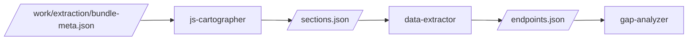

# Spec — Workflow modulable via fichier de conf YAML

> Date : 2026-05-21
> Auteur : Marc + Claude (brainstorming)
> Statut : design validé, en attente plan d'implémentation
> Scope : MVP — workflow seul. L'ingestion de données est une dérivation séparée à enchaîner après.

---

## 1. Problème à résoudre

Le pipeline awok souffre d'un problème de cohérence inter-sources :

| Source | Localisation | Taille | Format |
|---|---|---|---|
| **Runtime** (orchestrateur) | `claude-setup/skills/demo/SKILL.md` | 1070 lignes | Markdown prose libre |
| **Intention** (spec) | `docs/new_process_improve_coverage/spec-v2/*.md` | 8 docs | Markdown |
| **Visualisation** | `docs/architecture-cartography/` | 413 l. + HTML | Markdown + Mermaid manuels |
| **Agents** | `claude-setup/agents/*.md` | 18 fichiers, 2900 l. | Markdown + frontmatter |

**Quatre sources qui doivent rester cohérentes**. Drift déjà arrivé : commit `e699f70 fix(demo): SKILL.md coherence gaps from phase 3 review`. La spec V2 actuelle prévoit d'**étendre** SKILL.md (+200 lignes) sans rien faire pour la cohérence.

**Conséquences concrètes** :
- Impossible de visualiser le workflow sans régénérer manuellement les diagrammes Mermaid
- Impossible de modifier la structure (ajout/retrait de phase) sans éditer plusieurs endroits
- Impossible de rejouer un sous-ensemble du pipeline (passive-recon seule en cron, par exemple)
- Risque croissant de "machine à gaz" à mesure que la spec V2 grandit

## 2. Vision

**Un YAML est la source unique de vérité de la structure du workflow.** Un générateur produit le SKILL.md, la cartographie HTML, et un nouveau dataflow diagram. Les prompts détaillés de chaque invocation vivent dans des snippets markdown séparés (assemblés à la génération).

**Motivations classées par priorité** (validées avec Marc) :
1. **Documentation vivante** (priorité 1) : un endroit qui décrit le workflow, dont on génère les visuels automatiquement
2. **Modularité** : modifier la structure du workflow sans toucher au code de l'orchestrateur ni risquer d'incohérence
3. **Rejouabilité** : exécuter un sous-ensemble du pipeline (groupes) indépendamment

Hors scope MVP : configuration par target (override du workflow selon la cible).

## 3. Décisions structurantes (validées)

| Sujet | Décision | Justification |
|---|---|---|
| Source de vérité | YAML maître + générateur (vs édition manuelle SKILL.md, vs runtime parsing) | Pas de drift, pas de fragilité Claude-runtime |
| Granularité | Ossature dans YAML, prompts dans snippets markdown séparés | Équilibre lisibilité YAML / lisibilité prompts |
| Format | YAML + JSON Schema | Cohérent avec l'existant du repo (frontmatter, manifeste, configs) |
| Structure | DAG explicite (`depends_on`, `parallel_with`) | Pattern standard (GitHub Actions, Airflow), parsable |
| Scope MVP | Workflow seul | Ingestion = dérivation suivante (YAGNI) |
| Inputs/outputs | Au niveau **invocation** (pas phase), path + kind + description | Permet validation DAG via data-flow, dataflow diagram généré |
| Déclenchement | `triggers` coexistant avec `depends_on`, au niveau phase OU invocation | Modèle réactif sans casser le DAG planifié |

## 4. Architecture

### 4.1 Fichiers concernés

```
claude-setup/
├── workflow/
│   ├── workflow.yaml                    # Source unique de vérité
│   ├── workflow.schema.json             # JSON Schema de validation
│   └── templates/
│       ├── skill-skeleton.md.jinja      # Template ossature SKILL.md
│       ├── cartography.md.jinja         # Template cartographie texte
│       ├── cartography.mermaid.jinja    # Template flow de contrôle
│       ├── dataflow.mermaid.jinja       # Template flux de données
│       └── invocations/                 # Snippets par invocation agent
│           ├── js-cartographer.md
│           ├── data-extractor.md
│           └── ... (un par invocation)
├── scripts/
│   └── bb-workflow                      # CLI générateur (Python stdlib + PyYAML)
└── skills/demo/
    └── SKILL.md                         # GÉNÉRÉ — ne plus éditer à la main
```

### 4.2 Concepts modélisés

- `groups` : regroupement sémantique (passive-recon, active-collection, static-analysis, consolidation, active-exploit). Sert à la rejouabilité (`bb-workflow run --group passive-recon`)
- `phases` : étapes du DAG. Une phase contient une ou plusieurs invocations
- `invocations` : un agent appelé dans une phase (avec inputs/outputs/model/conditions)
- `brainstormings` : moments structurés hunter ↔ Claude (initial/mid/final)
- `triggers` : déclenchement réactif (par évènement observé)
- `conditions` : conditions de skip réutilisables

## 5. Schéma du YAML (référence)

Exemple condensé couvrant tous les concepts. **Les phases concrètes (T0a, T0b...) sont illustratives** — le contenu réel dépend de la décomposition de phases que Marc finalise en parallèle (chantier recon).

```yaml
schema_version: 1

# 1. GROUPS — sert à la rejouabilité
groups:
  passive-recon:
    description: Zero touch on target (crt.sh, Wayback, GitHub)
    risk: none
  active-collection:
    description: User-like collection (BR, external-collector, source-enricher)
    risk: low
  static-analysis:
    description: Analysis on collected data only
    risk: none
  consolidation:
    description: Ingester + outsider + brainstormings
    risk: none
  active-exploit:
    description: Probing payloads on target
    risk: high

# 2. PHASES — DAG explicite
phases:
  - id: T0a
    name: Recon passive
    group: passive-recon
    parallel_with: [T0b]
    invocations:
      - agent: recon-passive
        description: Crt.sh + Wayback + GitHub mentions
        model: sonnet
        background: true
        inputs:
          - { path: scope.md, kind: md }
        outputs:
          - { path: work/recon/passive/subdomains.txt, kind: text }
          - { path: work/recon/passive/wayback-urls.txt, kind: text }

  - id: T2
    name: Extract JS
    group: static-analysis
    depends_on: [T1]
    invocations:
      - agent: js-cartographer
        description: Carto des chunks, marque les sections pour Haiku
        model: sonnet
        inputs:
          - { path: work/extraction/chunks/, kind: dir }
          - { path: work/extraction/semgrep-results.json, kind: json, optional: true }
        outputs:
          - { path: work/extraction/cartography.md, kind: md }
          - { path: work/extraction/sections.json, kind: json }
      - agent: data-extractor
        description: Extraction mécanique endpoints/params
        model: haiku
        background: true
        depends_on_invocation: js-cartographer
        skip_if: no_sections_produced
        inputs:
          - { path: work/extraction/sections.json, kind: json }
        outputs:
          - { path: work/extraction/endpoints.json, kind: json }

  - id: T4
    name: Ingester
    group: consolidation
    depends_on: [T2, T3]
    type: script                          # ≠ agent par défaut
    cmd: data-ingester.py --target-dir . --sources collector,semgrep
    outputs:
      - { path: work/data.db, kind: sqlite }

  # PHASE RÉACTIVE — déclenchée par évènement observé
  - id: TR-bypass
    name: WAF bypass (réactif)
    group: active-exploit
    triggers:
      - on: event
        type: waf_blocked
        source: friction-detector
    invocations:
      - agent: waf-bypass

  # INVOCATION RÉACTIVE — un seul agent se redéclenche
  - id: T1-collect
    name: Collecte BR/external-collector
    group: active-collection
    invocations:
      - agent: br-triage
        triggers:
          - on: file_appears
            path: "work/flows_BR-*/"
        # cet agent se redéclenche quand une nouvelle session BR arrive,
        # sans relancer le reste de la phase

  # PHASE MAIN_AGENT — exécutée par l'orchestrateur lui-même (pas de Task tool)
  - id: T0-eval
    name: Phase 0 — Eval workspace
    group: consolidation
    type: main_agent
    description: Lit le manifeste, présente le bilan, attend confirmation
    inputs:
      - { path: work/.manifest.yaml, kind: yaml, optional: true }
      - { path: notes/session_end.md, kind: md, optional: true }
      - { path: scope.md, kind: md }
    outputs:
      - { path: work/.manifest.yaml, kind: yaml }

# 3. BRAINSTORMINGS — protocole structuré
brainstormings:
  - id: initial
    after_phase: T4
    before_phase: T5
    timebox_minutes: 15
    protocol: brainstorm-light            # ou brainstorm-deep (45-60 min)
    output:
      - { path: work/brainstorm-cycle-{N}-initial.md, kind: md }

# 4. CONDITIONS — conditions de skip réutilisables
conditions:
  no_sections_produced:
    check: file_missing
    path: work/extraction/sections.json
  external_dir_absent:
    check: dir_missing
    path: work/external/

# 5. SECTIONS MANUSCRITES — contenu du SKILL.md non généré
manual_sections:
  - { name: notes_importantes, path: workflow/manual/example-notes.md, insert_at: end }
  - { name: manifeste_management, path: workflow/manual/manifeste-management.md, insert_at: before_workflow_resume }
```

### 5.1 Types de phases

- `type: agent` (défaut) — invocations d'agents Claude Code
- `type: script` — exécution d'un script (Python, shell)
- `type: external` — outil externe (BR, external-collector) — pas géré par l'orchestrateur, juste documenté
- `type: main_agent` — étape exécutée par le main agent (ex : Phase 0 EVAL, lecture du manifeste)

### 5.2 Types de triggers

| `on:` | Sémantique | Câblé runtime au MVP ? |
|---|---|---|
| `file_appears` | Un fichier/dossier matchant un glob apparaît | **Oui** |
| `file_changes` | Hash d'un fichier change | Oui |
| `event` | Évènement émis par un hook (WAF, ban...) | Non (préparé, non câblé) |
| `db_event` | Évènement dans une table `events` de base de données | Non |
| `threshold_reached` | Stat dépasse un seuil (ex : >50 chain-source) | Non |

**MVP** : seul `file_appears` est câblé. Les autres types sont **modélisés dans le schéma mais pas implémentés côté runtime** — extensibilité préservée, pas de machine à gaz.

### 5.3 Valeurs par défaut des triggers

- **Priorité** : la phase planifiée en cours termine, puis la phase réactive s'insère **avant** la suivante
- **Idempotence** : un évènement → un déclenchement (consommé après match)
- **Garde-fou** : `max_triggers_per_cycle: 3` par défaut, configurable par phase

## 6. Snippets markdown d'invocation

Un fichier par invocation : `claude-setup/workflow/templates/invocations/<agent>.md`. Contient le **prompt détaillé** (lourd, créatif, non YAML-friendly).

### Format

```markdown
---
agent: js-cartographer
generated: false       # false = éditable à la main, ne pas écraser
---

Tu es l'agent js-cartographer. Lis ~/.claude/agents/js-cartographer.md pour tes instructions complètes.

Workspace : {{ workspace }}

## Inputs lus
{{ inputs_table }}     <!-- généré depuis YAML -->

## Output à produire
{{ outputs_table }}    <!-- généré depuis YAML -->

## Tâche
Lis chaque chunk et produis une carte du bundle. Pour les chunks avec hits
semgrep, marque les sections intéressantes avec des instructions pour Haiku.
Pour les chunks silencieux, lis un extrait et décide vendor/app.

## Contraintes
- Respecte le format `sections.json`
- Reste dans le budget tokens (~50K)
```

### Trois zones

- **Frontmatter YAML** : métadonnées (agent, generated)
- **Sections `{{ }}`** : générées depuis YAML à chaque `bb-workflow generate`
- **Sections prose** : éditées à la main, jamais écrasées (sauf `generated: true`)

## 7. Le générateur `bb-workflow`

### 7.1 Localisation et techno

- `claude-setup/scripts/bb-workflow` (Python stdlib + PyYAML, script sans extension `.py`, chargé via importlib pour les tests)
- Déployé en `~/.local/bin/bb-workflow` par `install.sh`

### 7.2 Interface CLI

| Commande | Rôle |
|---|---|
| `bb-workflow validate` | Valide `workflow.yaml` contre JSON Schema + cohérence (agents existent, depends_on cohérent avec inputs/outputs, conditions référencées existent) |
| `bb-workflow generate` | Produit SKILL.md + cartography (md + html) + dataflow.html. Idempotent. |
| `bb-workflow check` | Compare SKILL.md actuel avec ce qui serait généré → détecte le drift. Exit 1 si drift. Utilisé en pre-commit hook. |
| `bb-workflow diff <phase>` | Montre ce qui changerait si on régénérait, scopé à une phase |
| `bb-workflow assist <change>` | Invoque sub-agent Claude pour proposer modifs de snippets impactés |
| `bb-workflow new-phase --interactive` | Wizard sub-agent Claude pour ajouter une phase proprement |
| `bb-workflow rename-agent <old> <new>` | Renomme un agent dans le YAML, les snippets, et le fichier `agents/<name>.md` |
| `bb-workflow migrate-from-skill` | One-shot : parse SKILL.md existant → workflow.yaml + snippets bootstrap |

### 7.3 Étapes de `bb-workflow generate`

1. Charger `workflow.yaml` + valider contre `workflow.schema.json`
2. Charger les snippets `templates/invocations/*.md`
3. Calculer le DAG (croisement `depends_on` explicite + inputs/outputs)
4. Détecter incohérences (output orphelins, input sans amont) → warnings
5. Rendre les templates Jinja2 (substituer `{{ inputs_table }}`, `{{ outputs_table }}`, etc.)
6. Écrire les sorties :
   - `claude-setup/skills/demo/SKILL.md`
   - `docs/architecture-cartography/cartography-texte.md`
   - `docs/architecture-cartography/cartography.html` (mermaid livegen)
   - `docs/architecture-cartography/dataflow.html` (**nouveau** — dataflow inputs/outputs)
7. Imprimer un récap + suggestion de commit

### 7.4 Sub-agent Claude (assist)

Le sub-agent est invoqué via Task tool dans deux contextes :

- **Ajout/modif de phase** (`bb-workflow assist`) : reçoit le diff YAML + snippets existants, propose modifs de snippets + nouveau snippet si besoin. Hunter review puis accept/refuse.
- **Review de cohérence** (`bb-workflow review`) : reçoit workflow.yaml + tous les snippets + SKILL.md généré. Vérifie sémantiquement (pas juste structurellement) que les prompts collent au DAG.

C'est un **sub-agent Task tool**, donc tokens facturés normalement, pas SDK. Cohérent avec la règle `06-sdk-usage-rules.md`.

### 7.5 Pre-commit hook

```bash
# .git/hooks/pre-commit (ou via pre-commit framework)
bb-workflow check || {
  echo "SKILL.md drifte de workflow.yaml. Lance: bb-workflow generate"
  exit 1
}
```

Pas de drift possible : soit on régénère, soit le commit échoue.

## 8. Sorties générées

### 8.1 `cartography.html` — flow de contrôle

Diagramme Mermaid `flowchart TB`, équivalent à `docs/architecture-cartography/cartography.html` actuel mais **auto-généré**. Couleurs par `group`. Phases réactives marquées (bordure pointillée + label "réactif").

### 8.2 `dataflow.html` — flux de données (NOUVEAU)

Diagramme dérivé des `inputs`/`outputs` de chaque invocation. Permet de voir qui produit et qui consomme chaque artefact. Détecte visuellement les goulots d'étranglement (artefact lu par 5 agents = fragile).



### 8.3 `cartography-texte.md` — version ASCII

Équivalent texte (mobile, hors-ligne) — auto-généré. Remplace l'édition manuelle actuelle.

### 8.4 Mécanisme HTML

`build.py` existant est réécrit pour :
- Prendre le résultat Mermaid produit par `bb-workflow generate`
- L'injecter dans `_template.html` avec libs mermaid + svg-pan-zoom inlinées
- Sortir `cartography.html` ET `dataflow.html`

## 9. Migration de l'existant (one-shot)

But : transformer le SKILL.md actuel (1070 lignes prose) en `workflow.yaml` + snippets, sans perdre de contenu.

### Étapes (`bb-workflow migrate-from-skill`)

1. **Parser le SKILL.md** via sub-agent Claude (extrait : phases, invocations par phase, inputs/outputs, conditions de skip, prompts, brainstormings)
2. **Générer `workflow.yaml` bootstrap** : structure DAG inférée, à valider à la main
3. **Générer un snippet par invocation** dans `templates/invocations/*.md` (prompt actuel copié-collé)
4. **Hunter review** : diff visuel (YAML, snippets, SKILL.md original côte à côte)
5. **Boucle de validation** : `bb-workflow generate` → comparer avec original. Itérer sur le YAML jusqu'à ce que `bb-workflow check` dise "no drift sémantique" (le sub-agent compare prose vs prose, accepte les reformulations)
6. **Commit** : nouveau SKILL.md (généré) + workflow.yaml + snippets, ancien SKILL.md supprimé

### Sections du SKILL.md à préserver telles quelles

Non générées, déclarées dans `manual_sections:` :
- Frontmatter `name/description` du skill
- Section "Notes importantes" en bas (règles transverses)
- Sections "Manifeste Management" + "Multi-cycle" (schéma de fichier, pas du flow)

## 10. Tests et validation

### 10.1 Tests automatisés (`pytest claude-setup/scripts/tests/`)

- **Schema validation** : `workflow.schema.json` rejette un YAML invalide, accepte des cas valides
- **Génération** : snapshot test sur 3 fixtures workflow → SKILL.md attendu
- **Cohérence** : `bb-workflow check` détecte un drift artificiel
- **DAG** : détection de cycle, dépendance vers phase inexistante, output orphelin

### 10.2 Pre-commit hook

```bash
bb-workflow check || { echo "SKILL.md drifte. Lance: bb-workflow generate"; exit 1; }
```

### 10.3 CI

`bb-workflow validate && bb-workflow generate --check` doit passer.

## 11. Roadmap d'implémentation

| Phase | Livrable | Effort estimé |
|---|---|---|
| **P1 — Bootstrap** | `workflow.schema.json` + `workflow.yaml` minimal (3 phases) + `bb-workflow validate/generate` basique + templates de base | 2-3 jours |
| **P2 — Migration** | Script `migrate-from-skill` + sub-agent parser + workflow.yaml complet 18 agents + snippets | 2-3 jours |
| **P3 — Sub-agent assist** | `bb-workflow assist/new-phase --interactive` (wizard) + review | 1-2 jours |
| **P4 — Cartography + dataflow HTML** | Mermaid livegen + `dataflow.html` + remplacement de `build.py` | 1 jour |
| **P5 — Triggers `file_appears` câblés** | Modèle runtime des triggers + hook file watcher léger | 1-2 jours |
| **P6 — Dérivation ingestion** | Spec data-ingestion séparée (à enchaîner) | hors scope ici |

**Total MVP (P1-P4)** : ~6-9 jours. P5 différable si pas critique au démarrage.

## 12. Risques et questions ouvertes

À arbitrer au plan d'implémentation, pas au design :

1. **Qualité du parser sub-agent** : la migration depuis SKILL.md actuel dépend de la qualité d'extraction. Risque : itérations multiples. Mitigation : commencer la migration sur 2-3 phases, valider, puis dérouler.

2. **Synchronisation snippets ↔ agents** : si on renomme un agent, il faut renommer dans le YAML + le snippet + le fichier `agents/<name>.md`. Le script `bb-workflow rename-agent` est prévu mais doit être robuste (grep dans les snippets, mise à jour atomique).

3. **Détection du drift sémantique vs strict** : `bb-workflow check` doit comparer sémantiquement (pas juste byte-à-byte) sinon trop sensible aux reformulations triviales. Quel niveau de tolérance ? Suggestion : utiliser un sub-agent Claude pour le check sémantique en mode `check`, comparaison byte-à-byte en mode `check --strict`.

4. **Versioning du schema** : `schema_version: 1` aujourd'hui. Si on ajoute des concepts dans 6 mois (event types non triviaux, configuration par target), v2 = breaking ? Stratégie : `schema_version: 1` stable, ajout de champs optionnels OK, retrait/renommage de champs = v2 avec migrateur.

5. **Coordination avec le chantier recon en cours** : Marc redéfinit la décomposition de la recon en parallèle. Les phases T0a/T0b/T1 de la spec sont **illustratives uniquement**. Quand le chantier converge, l'édition se fait dans workflow.yaml directement (c'est précisément le bénéfice de cette spec). Si un nouveau concept émerge (ex : modèle de "skill" en first-class, déclenchement par signal complexe), évolution du schéma en v2.

6. **Sections manuscrites — frontière** : où s'arrête la génération automatique, où commence l'édition manuelle ? Le champ `manual_sections:` cadre ça, mais il faudra documenter clairement la convention.

## 13. Alternatives écartées (et pourquoi)

| Alternative | Pourquoi écartée |
|---|---|
| **YAML lu live par Claude au runtime** | Fragile (Claude peut mal interpréter), tokens dépensés à chaque session, debug difficile |
| **Pure documentation YAML (miroir manuel du SKILL.md)** | N'élimine pas le drift, juste l'ajoute en 4e source à maintenir |
| **SKILL.md complet généré (prompts dans le YAML)** | Prompts multilignes en YAML = illisibles, douloureux à éditer, conflits git brutaux |
| **TOML** | Le nesting d'un DAG le rend lourd (`[[phases]][[phases.invocations]]`) |
| **Mermaid + annotations** | Mermaid n'exprime pas `skip_if`, conditions complexes, ni les invocations détaillées. 80% du contenu finirait en annotation YAML → autant garder YAML pur. Faux ami. |
| **Python DSL** | Demande exécution pour lire = ce n'est plus de la conf, c'est du code. Barre d'entrée plus haute. |
| **Liste séquentielle plate** | Perd le DAG : impossible d'exprimer "T0a et T0b en parallèle, attendre les deux avant T1" |
| **Hybride phases + connecteurs séparés** | Plus de pouvoir d'expression mais 2× plus d'édition pour ajouter une phase. Overkill MVP. |
| **Catalogue de data-assets séparé** | 2 fichiers à synchroniser, surdimensionné pour le MVP. Sera réintroduit dans la dérivation ingestion. |
| **Configuration par target** | Hors scope MVP. Possible évolution future. |
| **Workflow + ingestion ensemble dans un seul design** | Risque de machine à gaz dès le départ. Séquencer = livrer vite + apprendre. |

## 14. Lien avec la spec V2 existante

Cette spec **n'invalide pas** la spec V2 (`docs/new_process_improve_coverage/spec-v2/`). Elle :

- **Remplace** la section "4. Skill orchestrateur `/demo` : étendu" de `05-integration-existing.md` (le SKILL.md n'est plus édité à la main)
- **Ajoute** un sous-projet : workflow YAML + générateur
- **Ne change pas** les agents, les hooks, les notes, les rules
- **Prépare** la dérivation suivante (data-ingestion) qui s'appuiera sur le même pattern de fichier de conf

Quand cette spec est implémentée, mettre à jour `docs/new_process_improve_coverage/spec-v2/05-integration-existing.md` §4 pour pointer vers ce doc.

---

## Décisions tranchées — résumé

1. ✅ Source unique = YAML maître + générateur (vs édition manuelle SKILL.md)
2. ✅ Granularité = ossature dans YAML, prompts dans snippets markdown séparés
3. ✅ Format = YAML + JSON Schema
4. ✅ Structure = DAG explicite (`depends_on`, `parallel_with`)
5. ✅ I/O = au niveau invocation, path + kind + description
6. ✅ Scope MVP = workflow seul (ingestion en dérivation suivante)
7. ✅ Sub-agent Claude pour assister modifs + review cohérence
8. ✅ Triggers `file_appears` câblés runtime au MVP, autres types préparés non câblés
9. ✅ Triggers utilisables au niveau phase OU invocation individuelle
10. ✅ Cartography auto-générée (HTML + texte) + nouveau dataflow.html
11. ✅ Pre-commit hook `bb-workflow check` pour bloquer le drift
12. ✅ Migration via sub-agent parser sur SKILL.md existant
